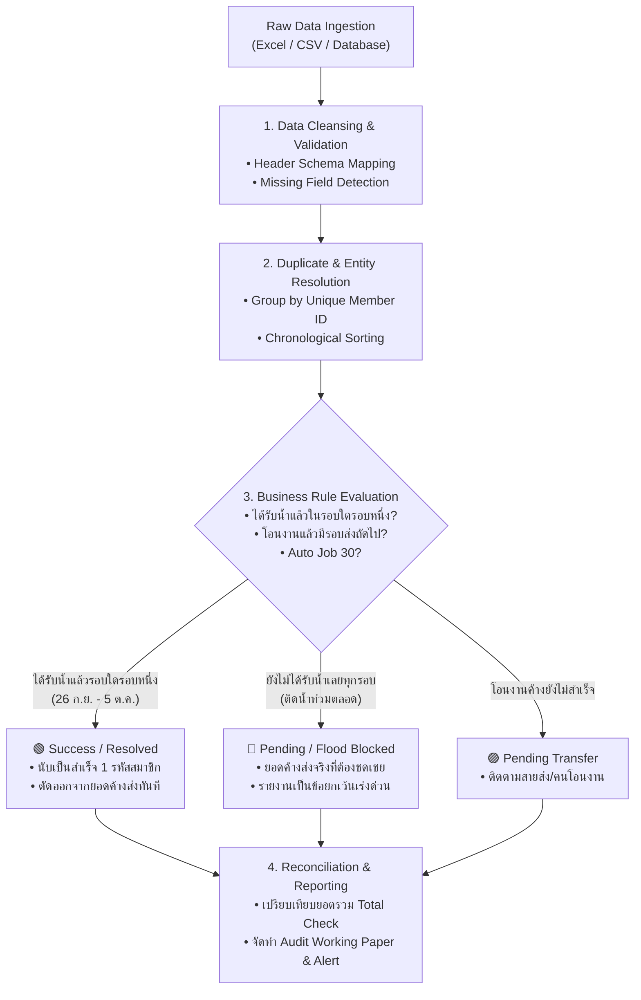

# Data Analytics & IT Audit Skills Manual
### คู่มือมาตรฐานทักษะการวิเคราะห์ข้อมูลและการตรวจสอบระบบสารสนเทศ (IT Audit & Data Analytics)

---

## 1. บทนำและวัตถุประสงค์ (Executive Overview & Objectives)

คู่มือนี้จัดทำขึ้นเพื่อเป็นแนวทางปฏิบัติมาตรฐาน (Standard Operating Procedure - SOP) และชุดทักษะสำหรับผู้ปฏิบัติงานด้าน **Data Analytics**, **IT Audit**, **Internal Audit (IA)** และ **Data Quality Engineering** โดยมุ่งเน้นการนำเทคนิคการวิเคราะห์ข้อมูลเชิงลึก (Computer-Assisted Audit Techniques - CAATs) มาประยุกต์ใช้ในการตรวจสอบระบบงานฐานข้อมูล กระบวนการปฏิบัติการจริง (Operational Systems) และการประเมินความสอดคล้องตามกฎระเบียบธุรกิจ (Business Rule Compliance)

### วัตถุประสงค์หลัก (Core Audit Objectives)
1. **Data Completeness & Accuracy**: ตรวจสอบว่าข้อมูลในระบบถูกบันทึกครบถ้วน สมบูรณ์ ถูกต้องตามข้อเท็จจริง และไม่มีการสูญหายหรือตกหล่น
2. **Business Logic Verification**: ตรวจสอบว่าโค้ดและระบบประมวลผลทำงานสอดคล้องกับนโยบายและกฎเกณฑ์ทางธุรกิจ (Business Rules & Lifecycle Policies) อย่างแม่นยำ
3. **Audit Trail & Traceability**: ยืนยันความพร้อมของร่องรอยการตรวจสอบ (Audit Trails) สามารถระบุได้ว่าใคร ทำอะไร เมื่อใด ที่ไหน และผลลัพธ์เป็นอย่างไร (Who, What, When, Where, Result)
4. **Separation of Duties (SoD) & Access Security**: ประเมินการแบ่งแยกหน้าที่และความปลอดภัยในการเข้าถึงข้อมูลสำคัญ (เช่น การควบคุม Row-Level Security, API Keys, Service Role Privileges)
5. **Exception & Anomaly Detection**: ค้นหารายการผิดปกติ (Anomalies), การทุจริตที่อาจเกิดขึ้น (Fraud Indicators), หรือข้อผิดพลาดแฝงในชุดข้อมูลขนาดใหญ่

---

## 2. กรอบแนวคิดมาตรฐานการตรวจสอบ (IT Audit Frameworks & Standards)

การดำเนินงานตรวจสอบสารสนเทศอิงตามมาตรฐานสากล ได้แก่:
* **ISACA IS Audit Standards & Guidelines**: มาตรฐานการตรวจสอบระบบสารสนเทศระดับสากล
* **COBIT 2019 (Control Objectives for Information and Related Technologies)**:
  * *BAI03 Managed Solutions Identification and Build*
  * *MEA01 Managed Performance and Conformance Monitoring*
  * *DSS05 Managed Security Services*
* **IIA Standards (IPPF - International Professional Practices Framework)**: มาตรฐานการปฏิบัติงานวิชาชีพการตรวจสอบภายใน
* **Data Management Body of Knowledge (DAMA-DMBOK)**: มิติด้านคุณภาพข้อมูล 6 ด้าน (Accuracy, Completeness, Consistency, Timeliness, Uniqueness, Validity)

---

## 3. มิติการวิเคราะห์และตรวจสอบคุณภาพข้อมูล (The 6 Data Quality Audit Dimensions)

| มิติการตรวจสอบ (Dimension) | คำนิยามและการทดสอบ (Definition & Audit Test) | ตัวอย่างกรณีศึกษาในระบบงานจริง (Real-World Case) |
| :--- | :--- | :--- |
| **1. Completeness (ความครบถ้วน)** | ตรวจสอบว่าข้อมูลไม่มีค่าสูญหายในฟิลด์สำคัญ (Mandatory Fields) เช่น รหัสสมาชิก, วันที่ทำรายการ, สถานะ | ตรวจสอบว่าออเดอร์ทุกรายการต้องมี `member_id`, `delivery_date`, และ `branch` กำกับเสมอ |
| **2. Uniqueness (ความไม่ซ้ำซ้อน)** | ตรวจสอบความซ้ำซ้อนที่ไม่ถูกต้องตามกฎธุรกิจ (Duplicate Detection) และการนับยอดแบบ 1 รหัสต่อสมาชิก | การประเมินสถานะสมาชิก 1 รายที่มีประวัติส่ง 4 ครั้ง ต้องถูกนับรวมเป็น **1 รหัสสมาชิก** ไม่นับเบิ้ล |
| **3. Accuracy (ความถูกต้อง)** | ตรวจสอบว่าค่าของข้อมูลสอดคล้องกับเอกสารหลักฐานจริงและสูตรคำนวณถูกต้อง | ตรวจสอบคอลัมน์เปลี่ยนน้ำ (`changed_water`) ต้องเป็นตัวเลข $\ge 0$ และตรงกับจำนวนถังจริง |
| **4. Consistency (ความสอดคล้อง)** | ข้อมูลในตารางหรือข้ามระบบต้องไม่ขัดแย้งกัน (Cross-table Consistency) | ข้อมูลระบุว่า "ส่งสำเร็จแล้ว" แต่ระบุเหตุขาดส่งว่า "น้ำท่วมสูง" ถือเป็นข้อขัดแย้งที่ต้องตรวจสอบ |
| **5. Validity (ความสมเหตุสมผลตามเกณฑ์)** | ค่าของข้อมูลต้องตรงตามช่วงที่กำหนด (Domain/Range Constraints) และรูปแบบที่ถูกต้อง (Data Formats) | รหัสสาขาต้องเป็น 1 ใน 4 สาขาที่กำหนด (รามอินทรา, กรุงเทพกรีฑา, สุขุมวิท 50, พระราม 3) |
| **6. Timeliness (ความทันกาลและตัดรอบ)** | ข้อมูลถูกบันทึกในรอบเวลาที่ถูกต้องตามเกณฑ์ Cut-off และลำดับเวลา (Chronological Integrity) | ตรวจสอบว่าการโอนงานสิ้นวันจาก 26 ก.ย. มีบันทึกวันที่โอนต้นทางถูกต้อง และส่งชดเชยภายในรอบ |

---

## 4. แผนผังกระบวนการตรวจสอบวงจรชีวิตข้อมูล (Audit Workflow & Lifecycle Verification)



---

## 5. กระบวนการตรวจสอบและแบบทดสอบทางสถิติ (Step-by-Step IT Audit Procedures)

### ขั้นตอนที่ 1: การนำเข้าและการจับคู่โครงสร้างข้อมูล (Schema Validation & Field Ingestion)
1. **Header Normalization**: ตรวจสอบว่าชื่อคอลัมน์จากไฟล์ต้นทาง (เช่น Excel ภาษาไทย) ถูกแปลงเข้าสู่ Data Model อย่างถูกต้อง:
   * คอลัมน์ A (`รหัสสมาชิก`) $\rightarrow$ `member_id`
   * คอลัมน์ B (`Member`) $\rightarrow$ `customer_name`
   * คอลัมน์ C (`วันเวลาที่ส่งน้ำ`) $\rightarrow$ `delivery_date`
   * คอลัมน์ D (`รอบ`) $\rightarrow$ `round`
   * คอลัมน์ E (`สถานะ`) $\rightarrow$ `status`
   * คอลัมน์ F (`เหตุขาดส่ง`) $\rightarrow$ `fail_reason`
   * คอลัมน์ H (`เปลี่ยนน้ำ`) $\rightarrow$ `changed_water`
   * คอลัมน์ K (`หมายเหตุระบบ`) $\rightarrow$ `transfer_raw`
2. **Positional Fallback Audit**: หากหัวตารางภาษาไทยไม่ตรงกัน ระบบมีตรรกะตรวจจับตำแหน่งอัตโนมัติ (Position-based Mapping) หรือไม่ โดยต้องไม่ทำให้คอลัมน์สลับกัน

### ขั้นตอนที่ 2: การตรวจสอบกฎวงจรชีวิตสมาชิก (Member Lifecycle Rule Audit)
* **Single Water Reception Rule (กฎการได้รับน้ำของสมาชิก 26 ก.ย. - 5 ต.ค.)**:
  $$\text{Member Status} = \begin{cases} \text{SUCCESS (สำเร็จ)}, & \exists \text{ attempt } i \in [26/9, 5/10] \text{ s.t. } \text{ReceivedWater}(i) = \text{true} \\ \text{PENDING (ค้างส่ง)}, & \forall \text{ attempt } i \in [26/9, 5/10], \text{ReceivedWater}(i) = \text{false} \end{cases}$$
* **Audit Assertion**: สมาชิกที่ได้รับน้ำแล้วในรอบใดรอบหนึ่ง จะต้อง:
  1. ถูกนับเป็นสำเร็จ **1 รหัสสมาชิก** ในยอดสรุป
  2. ถูกตัดยอดออกจากการประเมินเป็น "ติดน้ำท่วมค้างส่ง" โดยสิ้นเชิง (Excluded from `FAIL_FLOOD` / `FAIL`)
  3. ไม่ถูกนับซ้ำซ้อนในกลุ่มที่ยังไม่ได้รับน้ำ เพื่อป้องกันการรายงานเกินจริง (Overstatement of Pending Orders)

### ขั้นตอนที่ 3: การตรวจสอบร่องรอยการโอนงาน (End-of-Day Transfer Audit)
1. ตรวจสอบว่าในคอลัมน์ K (`transfer_raw`) มีข้อมูลผู้ทำรายการและวันที่โอนต้นทางครบถ้วน เช่น:
   `ผู้ทำรายการ: วีรวัฒน์ อุดมทรัพย์; โอนงานมาจากวันที่: 28/09/2026`
2. ตรวจสอบว่ามีการส่งต่องานจริง และตรวจสอบการปลดล็อกงานโอน (Resolved Transfer) หากในรอบถัดไปมีการส่งน้ำสำเร็จ

### ขั้นตอนที่ 4: การตรวจสอบความปลอดภัยและการแบ่งแยกหน้าที่ (Access Control & SoD)
1. **Database RLS Policies**: ในฐานข้อมูล Cloud (เช่น Supabase) ตรวจสอบว่า:
   * ตาราง `delivery_orders` เปิดใช้งาน `ROW LEVEL SECURITY (RLS)` หรือไม่
   * นโยบายการเขียนข้อมูล (INSERT/UPDATE) จำกัดสิทธิ์เฉพาะผู้ใช้ที่ได้รับอนุญาต หรือ Service Role เท่านั้น
   * ไม่เปิดสิทธิ์ลบข้อมูล (`DELETE`) ให้กับ Public Anonymous Role เพื่อรักษาความสมบูรณ์ของประวัติ (Immutable Audit Trail)

---

## 6. สคริปต์ตัวอย่างสำหรับการตรวจสอบ (Audit Analytics Scripts & Queries)

### 6.1 คำสั่ง SQL สำหรับตรวจสอบความผิดปกติ (PostgreSQL / Supabase)

#### ก. ค้นหารายการขัดแย้ง: ได้รับน้ำแล้วแต่ยังแสดงสถานะติดน้ำท่วมค้างส่ง (Contradiction Check)
```sql
-- ตรวจหาสมาชิกที่มีทั้งรอบส่งสำเร็จและรอบติดน้ำท่วม เพื่อดูว่าระบบตัดยอดถูกต้องหรือไม่
WITH member_summary AS (
    SELECT 
        member_id,
        customer_name,
        COUNT(*) AS total_attempts,
        BOOL_OR(change_bottle > 0 OR fail_reason LIKE '%ลูกค้าตั้งถัง%' OR fail_reason LIKE '%พบลูกค้า%' OR status = 'จัดส่งสำเร็จแล้ว') AS has_delivered,
        BOOL_OR(fail_reason LIKE '%น้ำท่วม%' OR status LIKE '%รอน้ำลด%') AS has_flood
    FROM public.delivery_orders
    WHERE delivery_date >= '2026-09-26' AND delivery_date <= '2026-10-05 23:59:59'
    GROUP BY member_id, customer_name
)
SELECT 
    member_id,
    customer_name,
    total_attempts,
    has_delivered,
    has_flood,
    CASE 
        WHEN has_delivered THEN '🟢 ต้องประเมินเป็น: สำเร็จ (ตัดออกจากยอดค้างส่ง)'
        ELSE '🔴 ต้องประเมินเป็น: ค้างส่งจริง (ต้องจัดส่งชดเชย)'
    END AS expected_audit_verdict
FROM member_summary
WHERE has_delivered = TRUE AND has_flood = TRUE;
```

#### ข. ตรวจสอบการบันทึกข้อมูลซ้ำซ้อนในวันและเวลาเดียวกัน (Duplicate Timestamp Check)
```sql
SELECT 
    member_id, 
    delivery_date, 
    truck_number, 
    COUNT(*) AS duplicate_count
FROM public.delivery_orders
GROUP BY member_id, delivery_date, truck_number
HAVING COUNT(*) > 1
ORDER BY duplicate_count DESC;
```

#### ค. ตรวจสอบความครบถ้วนของข้อมูลที่จำเป็น (Missing Mandatory Fields)
```sql
SELECT 
    id,
    member_id,
    customer_name,
    delivery_date,
    branch,
    truck_number
FROM public.delivery_orders
WHERE member_id IS NULL OR member_id = ''
   OR delivery_date IS NULL
   OR branch IS NULL OR branch = '';
```

---

### 6.2 สคริปต์ Node.js / JavaScript สำหรับ Automated Verification

```javascript
/**
 * Automated Audit Reconciliation Script
 * ทดสอบความถูกต้องของการตัดยอดและการนับสถิติ 1 รหัสต่อสมาชิก
 */
const fs = require('fs');
const assert = require('assert');

function auditMemberLifecycle(records) {
  const memberMap = new Map();
  
  // 1. Group records by unique member_id
  records.forEach(r => {
    const id = r.member_id || r.id;
    if (!memberMap.has(id)) {
      memberMap.set(id, []);
    }
    memberMap.get(id).push(r);
  });

  let auditedSuccessMembers = 0;
  let auditedPendingMembers = 0;
  const auditFindings = [];

  memberMap.forEach((attempts, mId) => {
    // กฎธุรกิจ: หากรอบใดรอบหนึ่งได้รับน้ำ ถือว่าสำเร็จทั้งวงจร
    const hasReceivedWater = attempts.some(a => {
      const changed = Number(a.changed_water || a.change_bottle || 0);
      const reason = (a.reason || a.fail_reason || '').toLowerCase();
      const status = (a.status || '').toLowerCase();
      const note = (a.note || '').toLowerCase();
      
      const isDelivered = changed > 0 ||
                          reason.includes('ลูกค้าตั้งถัง') ||
                          reason.includes('พบลูกค้า') ||
                          reason.includes('ลูกค้าอยู่บ้าน') ||
                          status.includes('จัดส่งสำเร็จแล้ว');
      const isAutoJob = note.includes('auto ปิด job 30') || reason.includes('งดรับน้ำ');
      return isDelivered || isAutoJob;
    });

    if (hasReceivedWater) {
      auditedSuccessMembers++;
    } else {
      auditedPendingMembers++;
      auditFindings.push({
        memberId: mId,
        attemptsCount: attempts.length,
        reasons: attempts.map(a => a.reason || a.fail_reason)
      });
    }
  });

  return {
    totalMembers: memberMap.size,
    auditedSuccessMembers,
    auditedPendingMembers,
    auditFindings
  };
}

module.exports = { auditMemberLifecycle };
```

---

## 7. ตารางประเมินความเสี่ยงและการควบคุม (Risk & Control Matrix - RCM)

| รหัสความเสี่ยง (Risk ID) | รายละเอียดความเสี่ยง (Risk Description) | ผลกระทบ (Impact) | กิจกรรมการควบคุม (Audit Control Activity) | วิธีการทดสอบการควบคุม (Test of Control) |
| :--- | :--- | :--- | :--- | :--- |
| **R-01: Duplicate Counting** | สมาชิกที่เข้าส่งหลายรอบถูกนับยอดค้างส่งซ้ำซ้อน ทำให้รายงานยอดค้างส่งสูงเกินจริง | วางแผนสายรถซ้ำซ้อน, เสียต้นทุนน้ำมันและแรงงาน | มีฟังก์ชัน `getMemberAggregation` รวมสถิติ 1 รหัสต่อสมาชิก | รัน Test Suite ตรวจสอบว่าสมาชิก 1 คนนับยอดเป็น 1 เสมอ |
| **R-02: False Pending on Resolved** | สมาชิกที่ได้รับน้ำไปแล้วในรอบก่อนหน้า แต่รอบถัดไปติดน้ำท่วม ถูกนับเป็นยังไม่ได้รับน้ำ | ลูกค้าได้รับการร้องเรียนผิดพลาด, รายงานประสิทธิภาพคลาดเคลื่อน | ตรรกะ `evaluateMemberLifecycle` ตัดยอดออกจาก `FAIL_FLOOD` ทันทีเมื่อมีรอบใดรอบหนึ่งสำเร็จ | ส่ง Mock Case 2 รอบ (สำเร็จ 1, น้ำท่วม 1) ตรวจสอบว่าต้องไม่ปรากฏในฟิวเตอร์ค้างส่ง |
| **R-03: Unauthorized Overwrite** | ข้อมูลการจัดส่งถูกแก้ไขหรือเขียนทับโดยไม่ได้รับอนุญาตในฐานข้อมูล Cloud | ข้อมูลถูกปลอมแปลง, ขาดร่องรอยการตรวจสอบ (Audit Trail) | กำหนด Supabase RLS Policy ให้ `INSERT` ได้เฉพาะคีย์ที่ถูกต้อง และปิดกั้น `DELETE` | ทดสอบเรียก API DELETE ผ่าน Anon Key ต้องถูกปฏิเสธ (401/403) |
| **R-04: File Parsing Error** | การอัปโหลดไฟล์ Excel ที่มีฟอร์แมตหัวตารางไม่ตรงตามมาตรฐานทำให้ข้อมูลตกหล่น | ยอดการจัดส่งไม่ครบถ้วน, ขาดข้อมูลสำคัญของสมาชิก | มีตรรกะ Positional Fallback และ Data Type Normalization รองรับ | นำเข้าไฟล์ตัวอย่างที่มีคอลัมน์สลับตำแหน่ง ตรวจสอบว่าข้อมูลตรงคอลัมน์ 100% |

---

## 8. แม่แบบกระดาษทำการการตรวจสอบ (Audit Working Paper Template)

```markdown
# AUDIT WORKING PAPER (WP-DA-01)
**หัวข้อการตรวจสอบ**: การทดสอบความถูกต้องของตรรกะประเมินสถานะการจัดส่งช่วงวิกฤตน้ำท่วม
**ระบบเป้าหมาย**: BCP Flood Delivery Tracking Web Application & Supabase Cloud
**ผู้ตรวจสอบ**: ผู้เชี่ยวชาญการตรวจสอบระบบสารสนเทศ (IT Audit Specialist)
**วันที่ตรวจสอบ**: 6 ตุลาคม 2569

---

### 1. วัตถุประสงค์ (Audit Scope & Objective)
เพื่อทดสอบและยืนยันว่า:
1. การนับสถิติสมาชิกยึดหลัก "1 รหัสต่อสมาชิก" ถูกต้อง ไม่นับซ้ำตามจำนวนรอบที่พยายามส่ง
2. หากสมาชิกได้รับน้ำแล้วในรอบใดรอบหนึ่ง (26 ก.ย. - 5 ต.ค.) ระบบจะตัดยอดออกจากกลุ่มค้างส่ง/ติดน้ำท่วมโดยสิ้นเชิง
3. ตัวกรอง Unified Master Filter Bar แสดงผลตรงตามเงื่อนไขทางธุรกิจ ไม่แสดงรายการเป็น 0 เมื่อมีข้อมูลอยู่จริง

---

### 2. วิธีการทดสอบ (Testing Methodology)
* **เครื่องมือ**: Node.js Automated Test Harness, SheetJS Parser, PostgreSQL Query Execution
* **ขนาดตัวอย่าง**: 100% Census Testing บนชุดข้อมูล 53,674 รายการ และชุดข้อมูลจำลองเคสวิกฤต 2,687 รายการ
* **ขั้นตอน**:
  1. วิเคราะห์โค้ดฟังก์ชัน `evaluateMemberLifecycle()` และ `applyGlobalFilters()`
  2. รันสคริปต์ทดสอบ `tests/test_sat26_water_sat3_flood_rule.js`
  3. ตรวจสอบการแสดงผลบน Web Dashboard และทดสอบการกรองวันที่ 26 ก.ย. - 5 ต.ค.

---

### 3. ผลการทดสอบ (Audit Test Results)
| รายการทดสอบ (Test Item) | ผลที่คาดหวัง (Expected Result) | ผลลัพธ์จริง (Actual Result) | สรุปผล (Verdict) |
| :--- | :--- | :--- | :---: |
| 1. เคสเสาร์ 26 รับน้ำแล้ว + เสาร์ 3 ติดน้ำท่วม | ประเมินเป็นสำเร็จ (SUCCESS) และตัดออกจาก `FAIL_FLOOD` | ไม่ปรากฏใน `FAIL_FLOOD`, ปรากฏใน `SUCCESS` | **PASS** |
| 2. เคสติดน้ำท่วมทั้ง 26 และ 3 (ไม่เคยได้น้ำ) | ปรากฏใน `FAIL_FLOOD` และ `FAIL` เป็นค้างส่งจริง | แสดงผลใน `FAIL_FLOOD` ถูกต้อง | **PASS** |
| 3. การกรอง "🟣 โอนงานที่ส่ง" | แสดงผลรายการโอนงานครบถ้วน 624 รายการ | แสดงผลครบถ้วน 624 รายการ (620 สมาชิก) | **PASS** |
| 4. การกรองวันที่ย้อนหลัง 26 ก.ย. บนงานโอน | ดึงงานโอนที่มีวันที่ต้นทาง 26/09/2026 มาแสดงผล | แสดงผลครบถ้วน 254 รายการ | **PASS** |

---

### 4. ข้อสังเกตและข้อเสนอแนะ (Findings & Recommendations)
* **ข้อสังเกต (Observation)**: ระบบเดิมมีเงื่อนไข `!latestStatus.isFlood` และ `!itemStatus.isFlood` ตกค้าง ทำให้เคสโอนงานและเคสสมาชิกที่ได้รับน้ำแล้วในรอบอื่นหลุดเข้าไปอยู่ในกลุ่มค้างส่ง
* **การแก้ไข (Remediation Done)**: ปรับปรุงตรรกะใน `Index_template.html` ให้ยึด `globalMemberStatusMap` และตัดยอดสมาชิกที่ `isAccessible = true` ออกจากตัวกรองค้างส่งทั้งหมดเรียบร้อยแล้ว
* **ข้อเสนอแนะเพิ่มเติม (Future Recommendation)**: ควรจัดให้มี Automated Regression Testing รันทุกครั้งก่อน Deploy ขึ้นสภาพแวดล้อม Production เพื่อป้องกันการเกิด Logic Regression ในอนาคต
```

---

## 9. สรุปคำศัพท์เฉพาะทางสำหรับงานตรวจสอบ (IT Audit Glossary)

* **CAATs (Computer-Assisted Audit Techniques)**: เทคนิคการใช้โปรแกรมคอมพิวเตอร์และสคริปต์ช่วยในการตรวจสอบข้อมูลขนาดใหญ่
* **Audit Trail (ร่องรอยการตรวจสอบ)**: บันทึกข้อมูลลำดับเหตุการณ์ที่เกิดขึ้นในระบบ ช่วยให้สามารถสอบย้อนต้นสายปลายเหตุได้
* **Completeness Test (การทดสอบความครบถ้วน)**: การทดสอบเพื่อยืนยันว่าไม่มีข้อมูลหรือรายการใดตกหล่นจากการประมวลผล
* **Cut-Off Test (การทดสอบการตัดรอบ)**: การตรวจสอบว่ารายการค้าหรือการจัดส่งถูกบันทึกในงวดเวลาหรือรอบวันที่ถูกต้อง
* **Entity Resolution (การระบุเอกลักษณ์ข้อมูล)**: กระบวนการรวมข้อมูลหลายรายการที่อ้างอิงถึงสมาชิกหรือนิติบุคคลคนเดียวกัน
* **Non-Repudiation (การปฏิเสธความรับผิดชอบไม่ได้)**: คุณสมบัติของระบบที่สามารถยืนยันตัวตนผู้ทำรายการได้อย่างหนักแน่นจนไม่สามารถปฏิเสธได้
* **RLS (Row-Level Security)**: กลไกความปลอดภัยในฐานข้อมูลที่จำกัดการอ่านหรือแก้ไขข้อมูลในระดับแถวตามสิทธิ์ของผู้ใช้งาน
